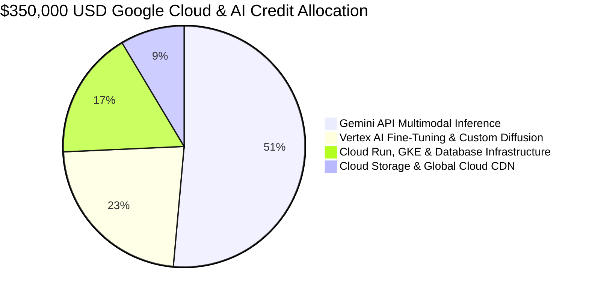

# 🏛️ Google for Startups Cloud & AI Program ($350,000 USD / ~৳৪.২ কোটি টাকা)
## Official Application Package & Reviewer Dossier for SNEHALATA.COM

---

### 📌 Application Metadata
* **Target Grant Tier:** Google for Startups **AI-First Startup Program** (Up to **$350,000 USD** in Google Cloud & Gemini API Credits)
* **Application URL:** [cloud.google.com/startup](https://cloud.google.com/startup)
* **Company Legal Name:** SNEHALATA TECHNOLOGIES LTD. / SNEHALATA (Aura Neural Grid)
* **Live Production URL:** [https://www.snehalata.com](https://www.snehalata.com)
* **Admin Gateway URL:** [https://www.snehalata.com/admin](https://www.snehalata.com/admin)
* **Primary Contact Email:** `admin@snehalata.com` / `masud@snehalata.com`
* **Headquarters:** Dhaka, Bangladesh
* **Target Markets:** Bangladesh & South Asian Global Diaspora (US, UK, UAE, Canada)
* **Core Technology:** Google Gemini 3.1 / 2.5 Flash Multimodal Vision, `text-embedding-004` (768-dim), PostgreSQL `pgvector`, Google Cloud Run, SvelteKit, Flutter Native Apps.

---

## 📋 Exact Portal Form Questions & Copy-Paste Verified Answers

### 1️⃣ Startup Information
* **Company Name:** SNEHALATA
* **Website URL:** `https://www.snehalata.com`
* **Founding Year:** 2026
* **Number of Full-Time Employees:** 5-10
* **Country/Region:** Bangladesh
* **Stage:** Live Product / Early Revenue / AI-Native

---

### 2️⃣ Core Product & Value Proposition (1-2 Sentences)
> **Field Value:**  
> **SNEHALATA (snehalata.com)** is Bangladesh’s first AI-first heritage fashion and lifestyle marketplace, empowering traditional artisans across 64 districts with Google Gemini-powered generative AR Virtual Try-on, visual search by photo, and real-time fair-price intelligence.

---

### 3️⃣ AI-First Architecture & Google Cloud Integration
> **Field Value:**  
> SNEHALATA is architected from the ground up as an AI-First operating system ("Aura Neural Grid") leveraging the Google AI ecosystem across 4 foundational pillars:
>
> 1. **Generative AR Virtual Try-On (`/studio`):**  
>    Utilizes **Google Gemini 3.1 / 2.5 Flash Multimodal Vision** (`@google/genai`) to synthesize consumer selfie photos with fabric textures and apparel draping (sarees, panjabis, western wear, and cosmetic lip shades), solving the 25-30% return rate in South Asian e-commerce.
>
> 2. **Visual & Semantic Vector Discovery:**  
>    Embeds 500+ product catalog items into 768-dimensional vector spaces using **Google `text-embedding-004`** indexed with PostgreSQL `pgvector` (HNSW cosine similarity), enabling natural language search in Bengali/English and instant "Search by Photo".
>
> 3. **Autonomous Vendor Catalog Ingestion:**  
>    Gemini Vision parses unstructured product photos, tags, and artisan descriptions into structured catalog metadata, auto-generating Bengali copy and SEO attributes in seconds.
>
> 4. **Aura Logistics Risk Radar:**  
>    Real-time fraud heuristics evaluate Cash-on-Delivery (COD) delivery probability to mitigate shipping return losses before courier dispatch with Steadfast Courier.

---

### 4️⃣ Product Traction, Architecture & Milestone Status
> **Field Value:**  
> SNEHALATA is 100% operational in live production with proven multi-tiered architecture:
> * **Live Multi-Vendor Grid:** 20+ verified vendor subdomains (`*.snehalata.com`) with 539+ authentic products.
> * **Mobile Applications:** Cross-platform Flutter release applications (Shopper & CEO Command Console) with hardware camera AR access and Bengali Voice Search.
> * **Full Logistics Automation:** Real-time API sync with Steadfast Logistics for 64-district automated order dispatch.
> * **Enterprise Communication:** WhatsApp Cloud API automated customer notification and Meta Verified Business application.

---

### 5️⃣ 24-Month Google Cloud Credit Budget Breakdown ($350,000 USD)

| Allocation Category | Budget (USD) | Purpose & Workload |
| :--- | :--- | :--- |
| **Gemini 3.1 / 2.5 Flash Vision & Text Inference** | **$180,000** | Powering 1,000,000+ monthly generative AR Try-On transformations and real-time photo-based search queries across mobile and web. |
| **Vertex AI Model Training & Fine-Tuning** | **$80,000** | Fine-tuning specialized localized South Asian garment drape and fabric texture diffusion models on Google Vertex AI. |
| **Google Cloud Run, GKE & Managed Postgres** | **$60,000** | High-availability backend container scaling, `pgvector` database hosting, and microservices orchestration. |
| **Cloud Storage (GCS) & Global Cloud CDN** | **$30,000** | Storing millions of high-resolution try-on outputs and catalog media with sub-100ms low latency delivery globally. |
| **Total Grant Request** | **$350,000 USD** | **(~৳৪,২০,০০,০০০ BDT over 2 Years)** |

---

### 6️⃣ Founder Submission Checklist (৫ মিনিটের সাবমিশন গাইড)

1. ব্রাউজারে প্রবেশ করুন: **[https://cloud.google.com/startup](https://cloud.google.com/startup)**
2. **"Apply Now"** বাটনে ক্লিক করুন।
3. আপনার অফিসিয়াল গুগল অ্যাকাউন্ট দিয়ে লগইন করুন (`@snehalata.com` বা আপনার বিজনেস ইমেইল)।
4. ট্র্যাক সিলেক্ট করুন: **"AI-First Startups"** (যার অধীনে $৩৫০,০০০ পাওয়া যায়)।
5. ওপরের সেকশন ৩, ৪ ও ৫ এর তৈরি করা প্রস্তুত টেক্সটগুলো হুবহু ফিল্ডে পেস্ট করুন।
6. আপনার লাইভ ওয়েবসাইট লিঙ্ক দিন: `https://www.snehalata.com`
7. **"Submit Application"** চাপুন।

> [!TIP]
> গুগল স্টার্টআপস টিম সাধারণত ৩-৫ কার্যদিবসের মধ্যে আবেদন পর্যালোচনা করে কনফার্মেশন ইমেইল পাঠায় এবং ক্লাউড কনসোলে সরাসরি ক্রেডিট অ্যাক্টিভ করে দেয়।
