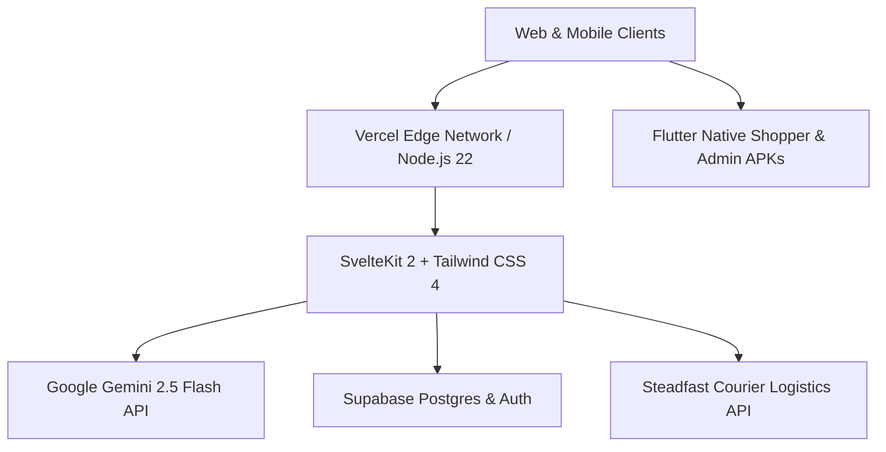

# 👑 SNEHALATA.com (স্নেহলতা)
### *Bangladesh's 1st AI-Powered Neural Grid Marketplace & Virtual AR Try-On Ecosystem*

<div align="center">

[](https://snehalata.com)
[](https://cloud.google.com/startup)
[](https://svelte.dev)
[](https://ai.google.dev)
[](https://flutter.dev)
[-000000?style=for-the-badge&logo=vercel&logoColor=white)](https://vercel.com)

</div>

---

## 🌟 Executive Overview

**SNEHALATA** (`snehalata.com`) is an advanced AI-native multi-vendor marketplace in Bangladesh, engineered to preserve traditional heritage handloom crafts (Tangail Tant, Rajshahi Silk, Jamdani, Comilla Khadi) while empowering modern fashion and retail brands with high-throughput generative AI infrastructure.

---

## 🚀 Core Platform Features

### 1. 👗 Aura Studio · Generative AR Try-On (`/studio`)
* **Live WebRTC Camera & File Upload**: Real-time camera selfie capture and gallery photo upload.
* **Google Gemini AI Transformation**: High-fidelity virtual apparel try-on allowing shoppers to preview sarees, panjabis, and western outfits on themselves before purchasing.
* **Instant Sizing & Fit Estimation**: AI-driven visual recommendation based on shopper morphology.

### 2. 👤 Customer Account & 1-Click Google Login (`/account`)
* **Direct Google / Gmail Sign-In**: Instant OAuth sign-in with verified Google user badges and zero password friction.
* **Real-Time Hub History & Parcel Tracking**: Detailed order lifecycles (`PLACED` ➔ `QUALITY_CHECK` ➔ `SHIPPED` ➔ `DELIVERED`).
* **Saved 64-District Shipping Book**: Automatic checkout address autofill across all divisions and upazilas.

### 3. 🌐 Aura Neural Grid · Unified Storefront
* **Multi-Store Aggregation**: Curated artisan nodes (Royal Bengal Looms, Rajshahi Silk House, Sylhet Couture, etc.).
* **Aura Moderation Trust Score (0–100)**: Autonomous product quality evaluation and Neural Verification badging.
* **Automated Web/Social Merchant Sync**: Background scraping and ingestion engine to import inventory directly from vendor websites.

### 4. 🚚 Logistics & Courier Grid (64 Districts)
* **Steadfast Courier API Integration**: Automated consignment generation, live status polling, and doorstep Cash on Delivery (COD).
* **Transparent Shipping Rates**: Dynamic geo-calculation for Inside Dhaka (৳78) and Outside Dhaka (৳118).

### 5. 📱 Mobile Native Grid (Flutter Android / iOS)
* **High-Performance WebView Shell**: Sub-second cold start, offline fallback resilience, dark-mode native media pickers, and deep intent linking (`tel:`, `whatsapp:`, `mailto:`).

---

## 🛠️ Architecture & Tech Stack



* **Frontend:** SvelteKit 2, Svelte 5 Runes, Tailwind CSS 4, Lucide Icons
* **AI & Machine Learning:** `@google/genai` (Gemini 2.5 Flash, Embeddings, Image Generation)
* **Database & Auth:** Supabase PostgreSQL, Google OAuth 2.0
* **Mobile Engine:** Flutter 3.x with Android API 34+ permissions and WebRTC bridge
* **Search Engine Optimization:** Dynamic XML Sitemap (1,130+ indexed URLs), Structured JSON-LD Schema, Google Search Console Verified

---

## 💻 Local Development Setup

### Prerequisites
* **Node.js**: v20.19.0+ or v22.x
* **Flutter SDK**: 3.24+ (for mobile apps)
* **npm** or **pnpm**

### Installation

```bash
# 1. Clone the repository
git clone https://github.com/khondokartowsif171/snehalata-ecosystem-auraai-clothing-hub.git
cd snehalata-ecosystem-auraai-clothing-hub

# 2. Install dependencies
npm install

# 3. Start local development server
npm run dev

# 4. Production Build Verification
npm run build
```

---

## 📞 Official Contacts & Support

* **🌐 Website:** [https://snehalata.com](https://snehalata.com)
* **📧 Official Email:** [contact@snehalata.com](mailto:contact@snehalata.com)
* **📱 Hotline & WhatsApp:** [+880 1317-685758](https://wa.me/8801317685758)
* **📍 HQ:** Dhaka, Bangladesh

---

<div align="center">
  <sub>© 2026 Snehalata Ecosystem. All rights reserved. Powered by Google Cloud & Gemini AI.</sub>
</div>
